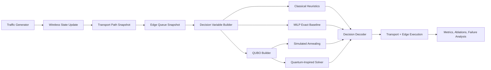

# QEdge6G

QEdge6G is a transport-aware resource allocation engine for AI-native 6G edge systems. It models wireless access, backhaul congestion, flow-level TCP or QUIC dynamics, finite edge compute, tenant slices, trace replay, and workload latency SLAs, then compares classical heuristics, an external MILP exact baseline, annealing, and a quantum-inspired QUBO solver on the same joint allocation problem.

## Problem Statement

Modern edge schedulers often optimize one layer at a time. In practice that breaks down:

- A user can have strong radio conditions but sit behind a congested backhaul path.
- The nearest edge can still be the wrong target when its compute queue is saturated.
- Shortest path routing can concentrate bursty TCP traffic onto the same bottleneck links.
- Greedy admission can improve instantaneous throughput while hurting p95 and p99 latency.

QEdge6G asks whether a quantum-inspired optimizer can improve user-to-edge assignment, path selection, bandwidth allocation, and compute placement under these coupled constraints.

## Why Current Baselines Fail

- `Shortest path + nearest edge` ignores backhaul queue spillover and edge overload.
- `Greedy` can over-admit flows that look cheap locally but collapse fairness or tail latency.
- `Pure load balancing` can move traffic away from hot edges while still piling into the same transport choke points.
- `MILP exact optimization` gives a strong gold reference, but runtime still grows once the candidate set and slice-aware constraints expand.

## Architecture



More detail lives in [architecture.md](docs/architecture.md).

## Optimization Summary

Each user gets a discrete candidate set over:

- edge destination
- transport path
- service tier (`degraded`, `nominal`, `priority`)
- drop or defer fallback

The engine minimizes a joint cost built from:

- end-to-end latency
- SLA miss penalty
- packet loss penalty
- compute placement pressure
- fairness reward

Subject to:

- one decision per user
- radio budget per base station
- path bandwidth budget
- edge compute capacity
- tenant-slice radio caps
- tenant-slice edge caps

The QUBO uses exact one-hot penalties plus capacity slack variables so decoded solutions can be checked against the same constraints used by the heuristics and exact baseline. The formulation and scaling caveats are documented in [qubo_formulation.md](docs/qubo_formulation.md).

## Why Quantum-Inspired Methods Are Relevant

- The joint problem is discrete and multi-resource constrained, which maps naturally into a QUBO.
- Even with a stronger MILP backend, exact optimization becomes the expensive reference as the scenario grows, which keeps approximate combinatorial search relevant.
- The quantum-inspired solver uses QUBO energy directly and mixes single-user and block-user moves to cross local barriers that trap plain greedy schedulers.
- The online path now supports warm starts and rolling-horizon demand forecasts so the quantum-inspired solver can be evaluated in a deployment-like loop rather than as a stateless one-shot search.
- The repo explicitly reports when this approach helps tail latency and when it fails on solution quality or runtime.

## Benchmark Setup

Included smoke-scale scenarios:

- `wireless_dense`
- `tcp_bursty`
- `edge_overload`
- `mobility_event`
- `trace_replay`
- `tenant_slicing`
- `backhaul_bottleneck`
- `mixed_workload_classes`
- `partial_link_degradation`

Added benchmark machinery:

- `scipy.optimize.milp` exact baseline
- sensitivity sweeps over user count, backhaul capacity, forecast error, and QUBO penalties
- rolling-horizon mode with warm starts
- trace replay from CSV
- tenant-slice caps for radio and edge capacity

Primary metrics:

- mean latency
- p95 latency
- p99 latency
- throughput
- goodput
- packet loss
- fairness
- queue delay
- edge utilization
- solver runtime
- solution quality gap
- constraint satisfaction rate

Benchmark protocol is documented in [benchmark_protocol.md](docs/benchmark_protocol.md).

## Smoke Results

The following numbers come from checked-in CSV artifacts:

- [wireless_dense.csv](results/tables/wireless_dense.csv)
- [tcp_bursty.csv](results/tables/tcp_bursty.csv)
- [trace_replay.csv](results/tables/trace_replay.csv)
- [tenant_slicing.csv](results/tables/tenant_slicing.csv)
- [sensitivity_sweep.csv](results/tables/sensitivity_sweep.csv)

| Scenario | Solver | Mean Latency (ms) | p95 (ms) | Goodput (Mbps) | Fairness | Runtime (s) | Observation |
| --- | --- | ---: | ---: | ---: | ---: | ---: | --- |
| wireless_dense | greedy | 20.86 | 27.32 | 190.28 | 0.81 | 0.000 | Fast, high goodput, weaker tail latency |
| wireless_dense | milp exact | 19.25 | 26.45 | 168.87 | 0.78 | 0.013 | Strong exact reference with higher admission rate |
| wireless_dense | quantum inspired | 19.30 | 25.41 | 166.13 | 0.77 | 0.546 | Better p95 than greedy, slower and lower goodput |
| tcp_bursty | greedy | 17.85 | 22.00 | 145.53 | 0.90 | 0.000 | Strong burst handling baseline |
| tcp_bursty | milp exact | 17.50 | 21.70 | 146.38 | 0.86 | 0.016 | Best checked-in latency reference |
| tcp_bursty | quantum inspired | 17.87 | 23.31 | 142.23 | 0.87 | 0.539 | Slightly worse p95 than greedy in this bursty case |
| trace_replay | milp exact | 18.56 | 22.39 | 59.29 | 0.78 | 0.009 | Strong trace-backed reference |
| tenant_slicing | milp exact | 21.89 | 28.77 | 142.07 | 0.83 | 0.020 | Best checked-in slice-aware fairness/latency tradeoff |

Current takeaways:

- The quantum-inspired solver now shows a real win in `wireless_dense`, where it beats greedy on p95 latency, but it does not dominate across all scenarios.
- In `tcp_bursty`, `trace_replay`, and `tenant_slicing`, the MILP backend is the strongest checked-in reference and the quantum-inspired path often trades goodput or runtime for only modest latency movement.
- In `edge_overload`, the quantum-inspired solver currently falls back to the greedy allocation, which is an intentional safety guard rather than a hidden failure.

Plots generated from the dense smoke benchmark:

- [solver_latency.png](results/figures/solver_latency.png)
- [queue_delay.png](results/figures/queue_delay.png)

## Failure Cases

- QUBO objective gap can still be materially worse than exact search even when p95 latency improves.
- In the checked-in `tcp_bursty`, `trace_replay`, and `tenant_slicing` runs, the quantum-inspired solver does not beat the MILP baseline and can lag greedy on goodput.
- In the checked-in `edge_overload` smoke run, the current quantum-inspired solver falls back to the greedy allocation because its candidate search fails the safety gate.
- The current discretization trades off fidelity for solver tractability; coarse bandwidth units can mask fine-grained scheduling gains.
- Synthetic topology generation is representative but not trace-perfect; assumptions are documented and should be challenged.
- MILP runtime is already growing with richer constraints and larger candidate sets, which is a core scaling signal rather than an implementation bug.

See [failure_analysis.md](docs/failure_analysis.md) for the current honest readout.

## Reproducibility

```bash
python3 -m pip install -r requirements.txt
python3 -m pytest
python3 -m src.cli benchmark --scenario configs/simulation/wireless_dense.yaml --solvers greedy exact simulated_annealing quantum_inspired --output results/tables/wireless_dense.csv
python3 -m src.cli benchmark --scenario configs/simulation/trace_replay.yaml --solvers greedy exact quantum_inspired --output results/tables/trace_replay.csv
python3 -m src.cli sensitivity-sweep --scenario configs/simulation/wireless_dense.yaml --solvers greedy exact quantum_inspired --steps 2 --sweep-config configs/benchmark_sensitivity_smoke.json --output results/tables/sensitivity_sweep.csv
python3 -m src.cli plot --input results/tables/wireless_dense.csv --output-dir results/figures
```

You can also use:

- `make test`
- `make smoke`
- `make benchmark`

## Repository Contents

- `docs/` contains the architecture, system assumptions, QUBO write-up, benchmark protocol, and failure-analysis notes.
- `notebooks/` contains executed analysis notebooks with checked-in outputs rather than import-only placeholders.
- `results/tables/` and `results/figures/` contain the checked-in smoke benchmark artifacts referenced above.
- `tests/` covers unit, integration, regression, and stress paths for the optimization and simulation loop.
