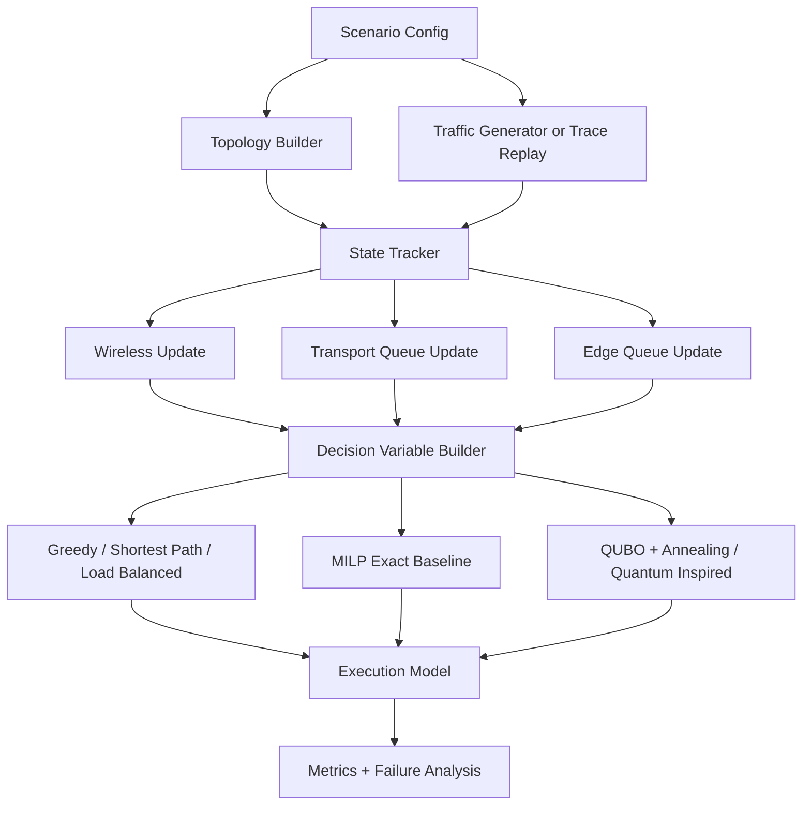

# Architecture

QEdge6G is organized as a pipeline with four stateful layers and one optimization layer:

1. `wireless`
   Converts channel quality, handoff hysteresis, and interference into spectral efficiency and radio budget demand.
2. `transport`
   Tracks backhaul queues, packet loss, and strengthened TCP or QUIC flow pressure.
3. `edge`
   Models finite compute, queueing, and per-workload placement cost.
4. `optimization`
   Builds candidate decisions, slice-aware constraints, QUBO penalties, MILP constraints, and decodes solver output.
5. `benchmarks` and `analysis`
   Run seed-locked scenarios, sensitivity sweeps, trace replay, and failure analysis.

Design choice summary:

- Topology is synthetic but structured enough to create real backhaul conflicts and path diversity.
- Users attach to base stations while edge servers sit behind transport aggregation nodes.
- Candidate options discretize service level to keep the QUBO size manageable while tenant-slice caps stay explicit.
- Rolling-horizon prediction and warm starts are available for online-style evaluation.
- Benchmarks rerun each solver from the same seed so system state is comparable.
